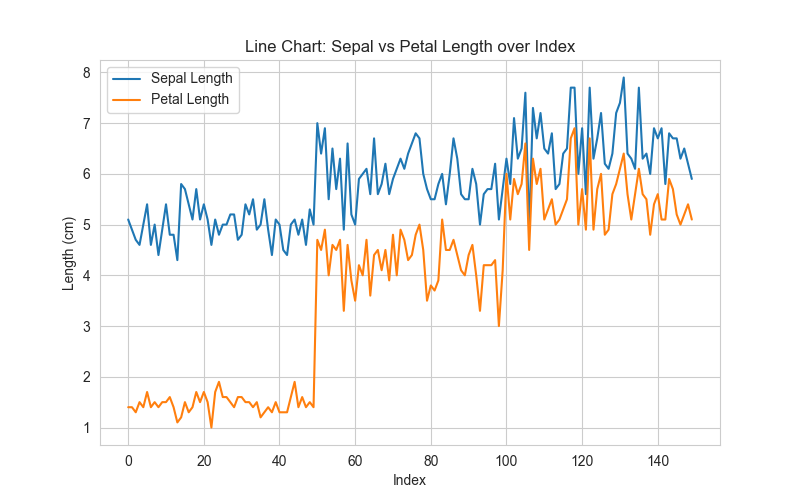
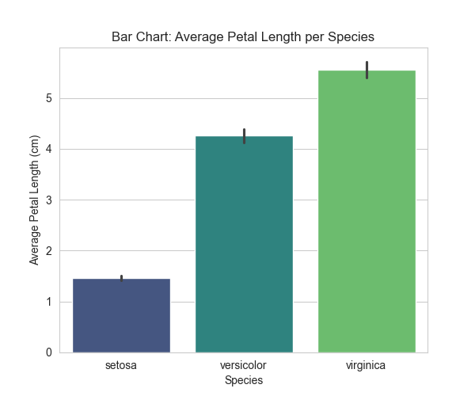
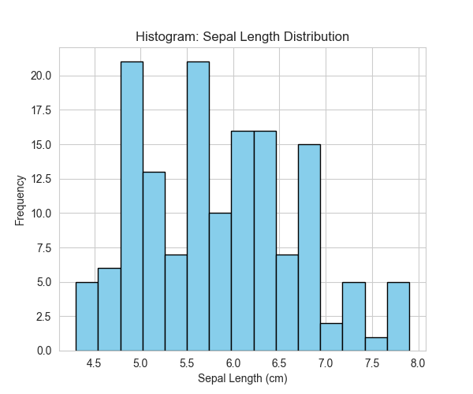
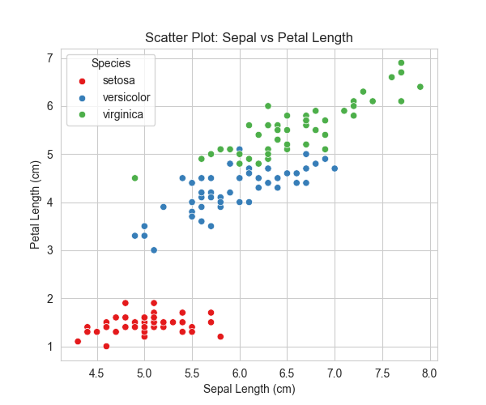

# 📊 Week 7 Assignment: Analyzing Data with Pandas and Visualizing Results with Matplotlib

## 🎯 Objective

The goal of this assignment is to:

- Load and analyze a dataset using **pandas**.
- Perform exploratory data analysis (EDA) and compute summary statistics.
- Create and customize plots using **matplotlib** and **seaborn**.
- Save plots while also displaying them briefly in a non-blocking way.
- Draw insights and observations from the visualizations.

---

## 📂 Dataset

- **Name**: Iris Flower Dataset
- **Source**: `sklearn.datasets.load_iris()`
- **Description**: A classic dataset with measurements of sepal length, sepal width, petal length, and petal width across three species of Iris flowers: _setosa_, _versicolor_, and _virginica_.

---

## 🛠️ Tools & Libraries

- **Python 3.x**
- [pandas](https://pandas.pydata.org/) – data analysis
- [matplotlib](https://matplotlib.org/) – visualizations
- [seaborn](https://seaborn.pydata.org/) – enhanced plotting
- [scikit-learn](https://scikit-learn.org/) – dataset loader

---

## 📌 Tasks Completed

### ✅ Task 1: Load and Explore the Dataset

- Loaded Iris dataset into a DataFrame.
- Displayed sample rows and structure with `.head()` and `.info()`.
- Verified no missing values.

### ✅ Task 2: Basic Analysis

- Computed summary statistics with `.describe()`.
- Grouped by species to compare averages.
- Observed key differences across species.

### ✅ Task 3: Visualizations

Generated **four plots** (saved into `plots/` folder and displayed for 3 seconds each):

1. **Line Chart** – Sepal vs Petal Length trends.
2. **Bar Chart** – Average petal length per species.
3. **Histogram** – Sepal length distribution.
4. **Scatter Plot** – Sepal vs Petal Length (colored by species).

---

## 📊 Saved Images Visualizations

### 📈 Line Chart – Sepal vs Petal Length over Index



### 🌿 Bar Chart – Average Petal Length per Species



### 📊 Histogram – Sepal Length Distribution



### 🌸 Scatter Plot – Sepal vs Petal Length



> _(Note: The images are generated by the Python script and saved in the `plots/` directory. Each plot is also briefly displayed during script execution.)_

## 🔎 Findings / Observations

- _Iris-virginica_ has the **largest petal length and width** on average.
- Sepal lengths show a **near-normal distribution** around ~5.8 cm.
- Strong **positive correlation** between sepal length and petal length.
- Dataset is **balanced and clean**, ideal for ML experiments.

---

## 🚀 How to Run

1. Clone/download the repo:
   ```bash
   git clone git@github.com:Deremas/july-2025-python-week-7-task-on-pandas-and-matplotlib.git
   ```

````
2. Install required libraries:
   ```bash
   pip install pandas matplotlib seaborn scikit-learn
````

3. Run the Python script:

```bash
python w-7_data_analysis-with_pandas_and_matplotlib.py
```

---

## 👨‍💻 Author

Name: Dereje Masresha

Course: Python Week 7 – Data Analysis & Visualization

Instructor: Mr. Zablon (PLP Instructor)

---
